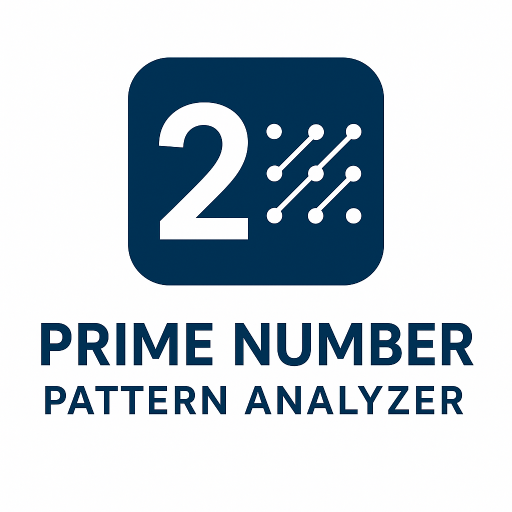

# Prime Number Pattern Analyzer

An advanced tool for professionals and students to analyze and visualize prime number patterns, including distribution, gaps between primes, and twin prime occurrences within a specified numerical range.

This application is built with React, TypeScript, and Tailwind CSS, featuring interactive charts powered by Recharts.



## Features

- **Prime Number Generation**: Utilizes the Sieve of Eratosthenes to efficiently generate prime numbers up to 2,000,000.
- **Comprehensive Analysis**: Calculates total primes, prime density, largest gap, and counts twin prime pairs.
- **Interactive Visualizations**:
    - **Prime Distribution Chart**: A bar chart showing how primes are distributed across different number ranges.
    - **Prime Gap Frequencies Chart**: A bar chart visualizing the frequency of different gap sizes between consecutive primes.
- **Twin Primes List**: Displays all twin prime pairs found within the specified range.
- **Responsive Design**: A clean and modern user interface built with Tailwind CSS that works on all screen sizes.
- **Quick Presets**: Easily analyze common ranges (100, 1,000, 10,000, 100,000) with a single click.

## Getting Started

Follow these instructions to get a copy of the project up and running on your local machine for development and testing purposes.

### Prerequisites

You need to have [Node.js](https://nodejs.org/) and [npm](https://www.npmjs.com/) installed on your system.

### Installation

1.  **Clone the repository:**
    ```bash
    git clone https://github.com/XIVIX-Official/prime-number-pattern-analyzer.git
    ```

2.  **Navigate to the project directory:**
    ```bash
    cd prime-number-pattern-analyzer
    ```

3.  **Install dependencies:**
    ```bash
    npm install
    ```

### Running the Application

1.  **Start the development server:**
    ```bash
    npm run dev
    ```
    This will start the development server and open the application in your browser.

2.  **Build for production:**
    If you want to create a production build, run:
    ```bash
    npm run build
    ```
    This will create a `dist` folder with the optimized, static assets for your application.

## License

This project is licensed under the MIT License - see the [LICENSE](LICENSE) file for details.

## Support & Contact

- **Issues**: Report bugs and request features via [GitHub Issues](https://github.com/XIVIX-Official/prime-number-pattern-analyzer/issues)
- **Discussions**: Join community discussions in [GitHub Discussions](https://github.com/XIVIX-Official/prime-number-pattern-analyzer/discussions)
- **Email**: info@codexustechnologies.com

## Community

Join our community to discuss medicinal plants, share research, and collaborate:

- GitHub Discussions - [GitHub Discussions](https://github.com/XIVIX-Official/prime-number-pattern-analyzer/discussions)
- Discord Channel - [XIVIX](https://discord.gg/U97cQvsA)

---

**Powered by XIVIX**

*Project inspired by the beauty and complexity of number theory.*